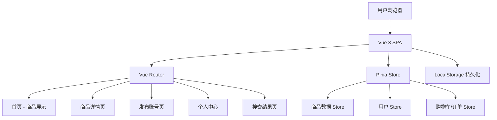
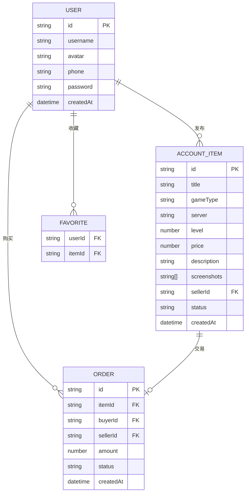

# 游戏账号交易平台 - 项目设计文档

## 1. 系统架构

## 2. 页面结构

| 页面 | 路由 | 说明 |
|------|------|------|
| 首页 | `/` | Banner轮播 + 游戏分类 + 热门商品 |
| 商品列表 | `/list/:game` | 按游戏筛选账号列表 |
| 商品详情 | `/detail/:id` | 账号详细信息 + 截图 + 下单 |
| 发布账号 | `/publish` | 卖家发布账号表单 |
| 个人中心 | `/profile` | 我的发布/我的订单/收藏 |
| 搜索结果 | `/search` | 关键词搜索结果 |
| 登录/注册 | `/login` | 用户认证 |

## 3. 数据模型

## 4. UI/UX 规范

- 主色调: `#6C5CE7` (紫色系，游戏风格)
- 辅助色: `#00D2D3` (青色高亮)
- 警告色: `#FF6B6B`
- 成功色: `#51CF66`
- 背景色: `#F8F9FE` (浅灰紫)
- 卡片背景: `#FFFFFF`
- 文字主色: `#2D3436`
- 文字次色: `#636E72`
- 字体: `'PingFang SC', 'Microsoft YaHei', sans-serif`
- 卡片圆角: `12px`
- 按钮圆角: `8px`
- 间距基准: `8px` (8/16/24/32)
- 卡片阴影: `0 2px 12px rgba(108, 92, 231, 0.08)`
